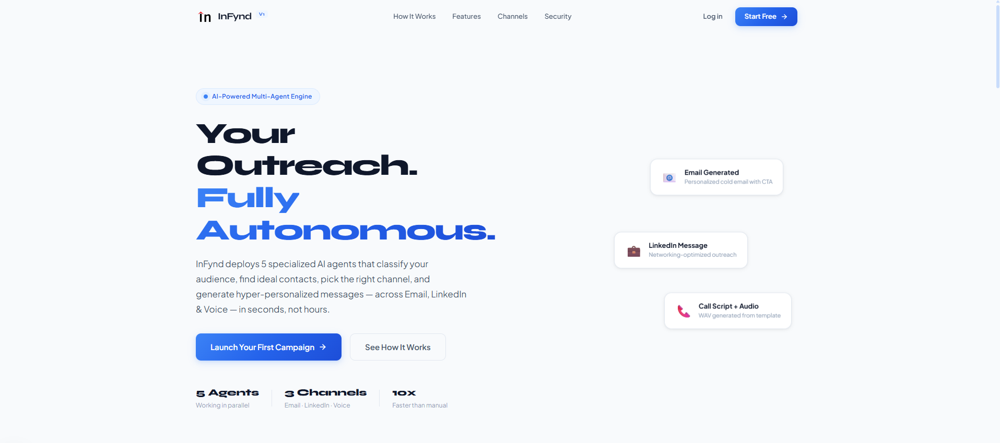

# 🚀 InFynd Campaign Engine

<p align="center">
  <strong>Enterprise-Grade B2B Multi-Channel Campaign Management Platform</strong><br/>
  Orchestrate · Approve · Track · Analyze
</p>

<p align="center">
  
  
  
  
  
  
  
</p>

---

## 🎬 Product Demo

<p align="center">
  <a href="https://chat.google.com/u/2/api/get_attachment_url?url_type=STREAMING_URL&content_type=video%2Fmp4&attachment_token=AOo0EEV6Tgn9g2UR6dY%2Bmod4kXUqRdtpkgoyvqOLn9cMH0z3iK6H%2F%2FEC0I6j%2F%2BY1K4YcyNJd68StZRZ57YgedrQNAThHkf8CsE3ewQ%2BMVNV%2FnAdroth1M95aE%2FjKGpgouS7gAIM%2B0C2CoUxJODA3c2A36UZGslIRzY0fAZJ9BouqNBXAy3qoeiEK2ERDIujWl3%2Bv6PLeqju8ugnf5vLXwtN3ApQWNiPhk83TQrS4p7KfkqF6wDGarYSri%2BJqALPuC7gbwj6Q%2FHjpg9bhWg9SD638F5WIWGrldO5f6%2FScuZ43vTJhCdIfSTGIi2URIdSzFevzxyCPMTlb8AMgm2GDMkhwSyw%2BIAVqXqblaGWOeGiP9K3ia6fNqcXHnnRrb0FpRA%2F1nzv%2B3%2Fb%2BiMeoRKtGph9m8%2B2l8iAWxdAzjvoOxlZ2gMcadILj11RhfYgAQWADVwj2ICwSV64AZaVuSGd4fM5itHxNqnIAN72bYZVGtuVnfnGk6UeRKfaLH6zsQL%2B6vUK8taRtLbee3n6oV1jVY8m1TewuWh2HnE6hLdEKYCKNb1ROELhD%2BV6WA2Bog5atn7hChCcmUsh%2F68tIKwNrCPhbJxa6ft3pFPnEkuIcRH2FKTZ7aLuRylVtQajAk1WH%2Bf0H8yVLsazockJeK5CZX4fc%2BpHoyA%2F0zFNaUwjB2Unorkha0UGip3GUpT8R%2Ffw4zWz9RDkQj0lIZK2aluhmjbY%2FbQ8uorsd1IAMYdQXHalGageFnwSCRMvEj3XMULti&video_format=22&authuser=2&cpn=nLxvgHbW3jXfbOPw&c=WEB_EMBEDDED_PLAYER&cver=1.20260217.11.00">
    
  </a>
</p>

<p align="center">
  <em>Click the preview above to watch a walkthrough of campaign creation, approval workflows, RBAC system, and analytics dashboards.</em>
</p>

---

# 📌 Overview

InFynd Campaign Engine is a full-stack B2B outreach orchestration platform designed to manage, approve, and analyze multi-channel outbound campaigns within organizations.

The system enforces structured collaboration through **Role-Based Access Control (RBAC)**, real-time analytics, Redis-backed performance enhancements, and approval-driven workflows.

Built for scalability, operational transparency, and enterprise-grade performance.

---

# ✨ Core Capabilities

## 📣 Multi-Channel Campaign Execution

- Email Campaigns  
- LinkedIn Outreach  
- Phone Campaigns  
- Channel-specific performance tracking  

---

## 🔐 Role-Based Access Control (RBAC)

| Role       | Permissions |
|------------|------------|
| **Admin**  | Full access: manage users, approve campaigns, view analytics |
| **Manager**| Create/edit campaigns, submit for approval, view analytics |
| **Viewer** | Read-only access to campaigns and analytics |

---

## 🏢 Company-Centric Workspace Model

- Company workspace created during registration  
- First user automatically assigned `ADMIN`  
- Admin can invite Managers & Viewers  
- Strict company-scoped data isolation  

---

## 📊 Real-Time Analytics

- Campaign engagement metrics  
- Channel-specific breakdown  
- Performance summaries  
- Approval lifecycle tracking  

---

## ⚡ Performance & Infrastructure

- Async FastAPI backend  
- PostgreSQL with connection pooling  
- Redis for caching / real-time enhancements  
- JWT-based authentication  
- Environment-driven configuration  

---

# 🧱 System Architecture

```
Frontend (Next.js 14 + TypeScript)
        │
        │ Axios + JWT
        ▼
Backend (FastAPI - Async)
        │
        │ SQLAlchemy (Async ORM)
        ▼
PostgreSQL
        │
        ▼
Redis (Caching / Performance Layer)
```

---

# 🛠 Tech Stack

## Frontend
- **Framework:** Next.js 14 (App Router)
- **Language:** TypeScript
- **UI:** Tailwind CSS
- **State/Data Fetching:** SWR + Axios
- **Icons:** Lucide React
- **Rendering:** React 18

## Backend
- **Framework:** FastAPI
- **Language:** Python 3.10+
- **ORM:** SQLAlchemy (Async)
- **Database:** PostgreSQL
- **Cache:** Redis
- **Authentication:** JWT (Bearer)
- **Validation:** Pydantic v2
- **Migrations:** Alembic

---

# 📂 Project Structure

```
InFynd/V1/
│
├── frontend/
│   ├── app/
│   │   ├── dashboard/
│   │   ├── layout.tsx
│   │   └── globals.css
│   ├── lib/
│   │   └── api.ts
│   ├── public/
│   └── package.json
│
├── infynd_campaign_engine/
│   ├── alembic/
│   ├── app/
│   │   ├── api/
│   │   ├── core/
│   │   ├── models/
│   │   └── schemas/
│   ├── main.py
│   ├── alembic.ini
│   ├── requirements.txt
│   ├── .env.example
│   └── .env (ignored)
│
└── README.md
```

---

# ⚙️ Local Development Setup

## 🔹 Prerequisites

- Node.js (v18+)
- Python (v3.10+)
- PostgreSQL (v14+)
- Redis (v6+)

---

## 1️⃣ Database Setup

```sql
CREATE DATABASE infynd_campaigns;
```

Ensure PostgreSQL and Redis are running locally.

---

## 2️⃣ Backend Setup

```bash
cd infynd_campaign_engine

python -m venv .venv

# Windows
.venv\Scripts\activate

# macOS/Linux
# source .venv/bin/activate

pip install -r requirements.txt
```

### 🔐 Environment Configuration

Copy the example environment file:

```bash
cp .env.example .env
```

Update the following values inside `.env`:

```
DB_HOST=localhost
DB_PORT=5432
DB_NAME=infynd_campaigns
DB_USER=postgres
DB_PASSWORD=postgres

REDIS_HOST=localhost
REDIS_PORT=6379

SECRET_KEY=generate-a-secure-random-key
```

⚠️ Never commit your `.env` file.

---

### Run Database Migrations

```bash
alembic upgrade head
```

---

### Start Backend Server

```bash
uvicorn app.main:app --reload --port 8000
```

API Base URL:
```
http://localhost:8000
```

Swagger Documentation:
```
http://localhost:8000/docs
```

---

## 3️⃣ Frontend Setup

```bash
cd frontend

npm install
npm run dev
```

Frontend URL:
```
http://localhost:3000
```

If needed, configure:

```
NEXT_PUBLIC_API_URL=http://localhost:8000/api/v1
NEXT_PUBLIC_WS_URL=ws://localhost:8000/api/v1
```

inside `frontend/.env.local`.

---

# 🔐 Authentication Flow

1. Company registers → Workspace created → Assigned `ADMIN`
2. Login → Access Token + Refresh Token issued
3. Admin invites Managers / Viewers
4. Protected routes validate JWT
5. Role-based endpoint enforcement

---

# 🚀 Production Readiness

- Async-first backend architecture  
- Redis-backed performance layer  
- Configurable DB connection pooling  
- Strict RBAC enforcement  
- Migration-based schema control  
- Environment-isolated configuration  
- Company-level data segregation  

---

# 🧪 API Documentation

Interactive Swagger UI:
```
/docs
```

OpenAPI schema:
```
/openapi.json
```

---

# 🔮 Planned Enhancements

- Campaign scheduling
- AI-driven campaign optimization
- Webhook integrations
- Real-time dashboard streaming
- Dockerized production deployment
- Observability & monitoring stack

---

# 📜 License

Proprietary & Confidential  
All rights reserved by **InFynd**